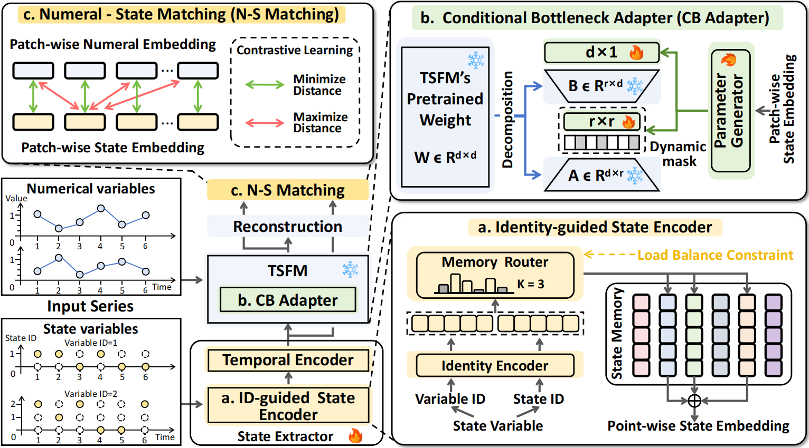

<h1>
    
    <span>STAR: Boosting Time Series Foundation Models for Anomaly Detection through STate-aware AdapteR</span>
</h1>

## Introduction

In this study, we propose STAR, a novel STate-aware Adapter for Time Series Foundation Models (TSFMs) in the Multivariate Time Serie Anomaly Detection (MTSAD) to
better model *state variables* during the fine-tuning phase. First, to better extract features from *state variables*, we designed a *State Extractor* capable of simultaneously capturing both the categorical information and temporal patterns of *state variables*. This module incorporates an *Identity-guided State Encoder* which establishes a small-scale State Memory and retrieves a composite memory’s representation to encode categorical information guided by both Variable Identity and State Identity. This method effectively modeling the complex semantics of *state variables*. Second, we propose a *Conditional Bottleneck Adapter*. By dynamically generating low-rank adaptation parameters and bottleneck size conditioned on the *state variables*, this module better integrates the condition-based influence of *state variables* into the backbone. Building upon the aforementioned modules, we can already perform state-aware fine-tuning. Furthermore, we have developed a *Numeral-State Matching* module to more effectively detect anomalies contained within the *state variables*

The below figure provides a overview of STAR's pipeline.

<div align="center">
    
</div>


## Quickstart

> [!IMPORTANT]
>
> this project is fully tested under python 3.8, it is recommended that you set the Python version to 3.8.

1. Installation:

Given a python environment (**note**: this project is fully tested under **python 3.8**), install the dependencies with the following command:

```shell
pip install -r requirements.txt
```

2. Data preparation

Prepare Data. You can obtain the well pre-processed datasets from [Google Drive](https://drive.google.com/file/d/1V5BAHWBKU8uih3hE1R7WdF6_crZlIbQT/view?usp=drive_link). Then place the downloaded data under the folder `./dataset`.  

3. Checkpoints preparation

You can download the checkpoints from [Google Drive](https://drive.google.com/file/d/19KlK2MW2_0t50DwLrQTQpXVy8f3Vh4dV/view?usp=sharing). After obtaining the files, follow the steps below to organize them:
For pre-train models (DADA, UniTS, Moment and Timer), move the files to the folder `ts_benchmark/baselines/pre_train/checkpoints`. Ensure the files are placed in the correct directories for proper functionality.

4. Train and evaluate model

We provide the experiment scripts for all benchmarks under the folder `./scripts/multivariate_detection`.

5. Evaluate the TSFMs with standard fine-tuing.
```shell
sh ./scripts/evaluation/Backbone.sh
```

6. Evaluate the TSFMs with State-aware AdapteR (STAR).
```shell
sh ./scripts/evaluation/STAR.sh
```